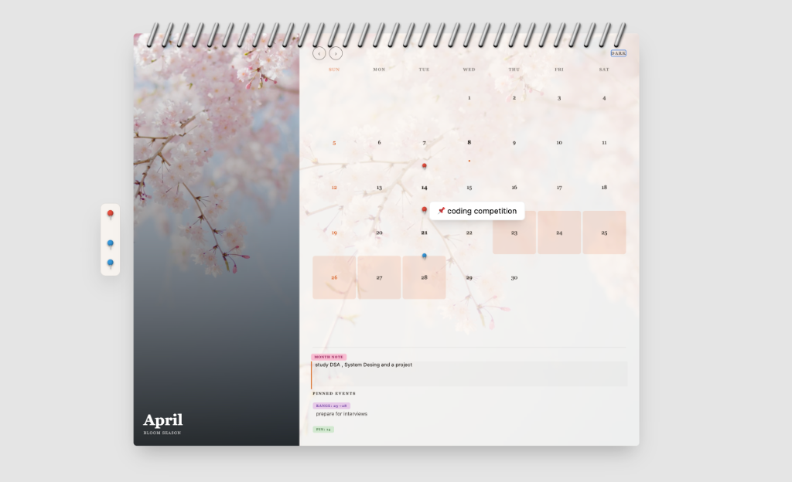
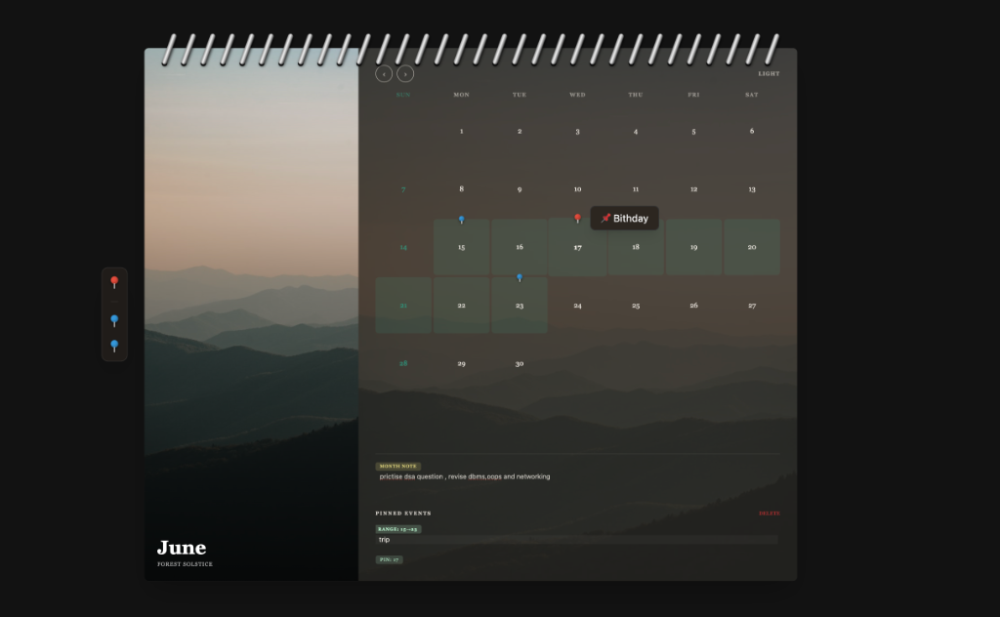

# Interactive 3D Wall Calendar

An interactive, high-fidelity React wall calendar designed for both stunning visuals and a robust user experience. This project bridges physical skeuomorphism (wire coil bindings, paper textures, 3D page flips) with digital utility (drag-and-drop event pinning, local-storage state persistence, and dynamic themes).


*Light mode interface with interactive 3D elements.*


*Dark mode interface showcasing the aesthetic theme transitions.*

## Interactive Features

- **Drag-and-Drop Pinning**: 
    - **Single Day (Red Pin)**: Drag a red pin onto any date to create a specific event marker.
    - **Date Ranges (Blue Pins)**: Drag two blue pins onto different dates. The application automatically calculates the range, highlights the span with a theme-aware color, and creates a consolidated "Range Note".
- **Dynamic Note Management**:
    - **Selection State**: Clicking on a pinned date or a general month area focuses that specific note in the side panel.
    - **Highlighter Themes**: Notes are automatically assigned a vibrant "highlighter" background color derived from their unique key, ensuring visual distinction between events.
    - **Deletion Workflow**: To remove a pin or range, simply select the corresponding note in the sidebar and click the **Delete** button. The calendar instantly cleans up the associated pin and UI state.
- **Persistent State**:
    - Every note, pin placement, and toggle (like Dark Mode) is automatically synced to `localStorage`. Your data remains intact across page refreshes and browser sessions.
- **Skeuomorphic Interaction**:
    - **Page Flips**: Navigating months triggers a 3D rotation and exit animation, simulating a physical calendar page being turned.
    - **Realistic Tooltips**: Hovering over holidays or pins surfaces a floating tooltip that tracks mouse movements for immediate context without manual clicks.

## How to Run Locally

If you don't already have the dependencies installed, run:

```bash
# Install dependencies
npm install

# Start the development server
npm run dev
```

Visit the local Vite server (usually `http://localhost:5173`) in your browser to view the application.

## Component Architecture

The calendar has been thoughtfully factored into distinct, self-contained files aimed at clear separation of concerns:

- **`src/App.jsx`**: The grand orchestrator. Manages layout sizing, state orchestration, layout logic, drag-and-drop handling, and the Framer Motion 3D transitions.
- **`src/data.js`**: Holds pure utility functions (`dateKey`, `isInRange`) and application constants including the month matrix, month-specific thematic data (images, palettes), and the `INDIAN_HOLIDAYS` dictionary. Moving this data parsing out of the rendering loop ensures `App.jsx` remains clean and completely focused on UI layout.
- **`src/components/PinIcon.jsx`**: An isolated SVG/CSS construction rendering the 3D draggable calendar pins with realistic lighting, specular highlights, and metallic stems.
- **`src/components/HighlighterNote.jsx`**: A specialized component to capture stateful, stylized text notes that automatically theme themselves using predefined hue patterns, replicating the feel of vibrant ink highlighters.

## CSS & Styling Implementation

The project heavily utilizes **Tailwind CSS** paired with custom standard CSS injected through `src/App.css`. 

- **Tailwind Utility**: Drives the rapid layout scaffolding, flexbox structures, responsive viewport breaks (e.g., `md:flex-row`), and generic aesthetics.
- **Standard CSS Extensions**: Utilized for extremely granular, precision-based skeuomorphic effects. For instance, the `.spiral-wire` class relies on complex multi-stop linear gradients to simulate a metallic highlight and nested box-shadows to punch realistic "holes" into the calendar page.
- **Dynamic CSS/JS Hybridization**: Because dark mode states and theme color accents change effortlessly on the fly every time the month is flipped, color-dependent styles (floating tooltips, pin halos, highlighter background arrays) are calculated in JavaScript and dynamically injected as inline styles. 

## State Management

1. **Persistent Local Data**: Instead of heavy Redux or extensive backend databases, the application elegantly synchronizes the `notes` React state with the browser's `localStorage`. When the page reloads, all user notes, pins, and highlights automatically hydrate back into the DOM.
2. **Contextual State Keying**: The `notes` dictionary is keyed via pure string manipulation for extreme performance. Notes are stored intelligently via context: `YYYY-MM` for general month overviews, `red:YYYY-MM-DD` for single-day pins, and `range:YYYY-MM-DD:YYYY-MM-DD` for blue duration markers.
3. **Animation Presence**: Framer Motion uses the current `viewMonth` integer to drive the `<AnimatePresence>` custom `<motion.div>` variants. By tracking the `flipDir` (direction of navigation), the state engine seamlessly delegates physics-based page-flip transitions left or right to give spatial depth.

## UX/UI Design Excellence

Every interaction comes with subtle visual feedback:
- **Physicality**: Deep shadows emulate distance off the "wall". The `perspective-distant` logic gives the rotating component realistic 3D clipping as pages turn. 
- **Dynamic Themes**: Every month features a highly evocative background image alongside an intelligent accent color palette that seamlessly adjusts UI text colors, date highlights, and borders.
- **Micro-interactions**: Hovering over specific holidays or pinned dates surfaces a smooth floating tooltip that perfectly anchors and tracks your mouse coordinates `(e.clientX, e.clientY)`. The highlighter text areas gracefully transition styles when they gain `:focus`, revealing soft border color cues.

## Responsive Design Constraints

Designing a robust desktop calendar while remaining accessible on mobile involved calculated constraints:
- **Scroll Enclosures**: Instead of allowing the component to endlessly stretch downward and break the design as notes are added, the parent container mandates a strict bounded height class (`md:h-[650px]`). We pushed `flex-1` and `overflow-y-auto` rules securely onto the child text container, creating a confined native scrollbar that respects the calendar's physical UI footprint.
- **Fixed Monthly Grids**: The calendar array iteration loops forces exact 42-day slots (6 rows of 7 days) regardless of how short a month is. This means flipping months will *never* cause the calendar interface to aggressively shrink or leap around vertically.
- **Adaptive Stacking**: On mobile, the horizontal split drops into a clean `flex-col`, positioning the thematic imagery compactly. This preserves target sizes for touch drag-and-drop actions without squashing the monthly grid.
